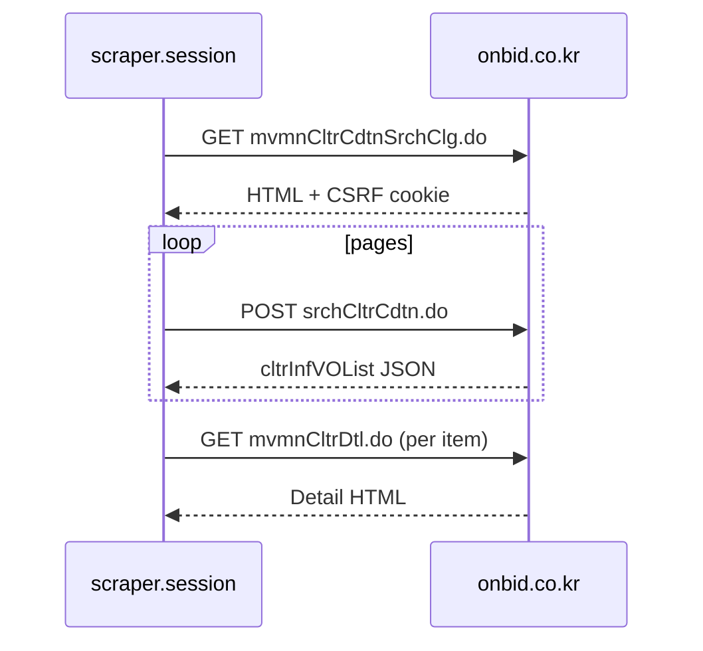

# Onbid condition search API (reverse-engineered)

Base: `https://www.onbid.co.kr`

## 1. Search page (session + CSRF)

| Method | URL |
|--------|-----|
| GET | `/op/cltrpbancinf/cltr/cltrcdtnsrch/CltrCdtnSrchController/mvmnCltrCdtnSrchClg.do` |

- Returns HTML search form (조건검색).
- CSRF tokens in `<meta>`:
  - `name="_csrf"` → token value
  - `name="_csrf_header"` → `X-CSRF-TOKEN`
- Probe sample: [`docs/probe-results.json`](probe-results.json)

## 2. List search (JSON)

| Method | URL |
|--------|-----|
| POST | `/op/cltrpbancinf/cltr/cltrcdtnsrch/CltrCdtnSrchController/srchCltrCdtn.do` |

### Required headers

| Header | Value |
|--------|-------|
| `X-CSRF-TOKEN` | From GET page meta `_csrf` |
| `X-Requested-With` | `XMLHttpRequest` |
| `Content-Type` | `application/x-www-form-urlencoded; charset=UTF-8` |
| `Referer` | Search page URL |
| `Accept` | `text/plain, */*; q=0.01` |

### Response

JSON object with `cltrInfVOList` (array) and pagination fields on each row (`rowcount`, `pageIndex`, `recordCountPerPage`).

Sample payload: [`docs/probe-request.json`](probe-request.json)

### Pagination

- `pageIndex` — 1-based page number
- `pageUnit` — rows per page (default `10`, scraper uses `30`)

## 3. POST field mapping (criteria → form)

| User criterion | Form field | Value |
|----------------|------------|-------|
| Real estate | `srchCltrType` | `0001` |
| Sale (매각) | `srchDspsMthod` | `0001` |
| Usage types (multi) | `srchPrptType` | repeat per code (see `criteria.yaml`) |
| Electronic bid | `srchBidMthod` | `0001` |
| General competition | `srchBidDivType` | `0001` |
| Max min bid 300M KRW | `srchLowstBidEndPrc` | `300000000` |
| Min building 24㎡ | `srchBldSqmsType` | `RANGE` |
| Min building 24㎡ | `srchMinBldLdar` | `24` |
| No share | `srchShrYn` | `N` |
| Bid period | `srchBidPerdType` | `0002` |
| Bid period start | `srchBidPerdBgngDt` / `calBidPerdBgngDt` | `YYYY-MM-DD` (today) |
| Bid period end | `srchBidPerdEndDt` / `calhBidPerdEndDt` | `YYYY-MM-DD` (+30d) |
| Regions (multi) | `srchArrayRgn` | repeat region codes |
| Sort | `srchSortType` | `ASC` |
| Word search type | `srchWordType` | `0001` |

Region codes (서울): configured in `scraper/config/criteria.yaml` as `srch_array_rgn`. Post-filters refine Songpa 5-dong and Gangnam whitelist + Seolleung 3km.

## 4. JSON list row → domain fields

| VO field | Meaning |
|----------|---------|
| `onbidCltrno` | Onbid property ID |
| `pbctCdtnNo` | Auction condition no |
| `pbctNo` | Auction no |
| `onbidPbancNo` | Announcement no |
| `onbidCltrNm` | Title / address text |
| `sidoSgkEmd` | Region line |
| `sggnm`, `emdNm` | District, emd |
| `ctgrFullNm`, `ctgrNm`, `usgNm` | Category / usage |
| `lowstBidPrc` | Minimum bid (KRW) |
| `cltrApslEvlAvgAmt` | Appraisal |
| `bldSqms`, `landSqms` | Building / land m² |
| `cptnMthodCd`, `cptnMtdNm` | Competition method |
| `bidMthodCd` | Bid method |
| `dspsMthodCd`, `dspsMthodNm` | Disposal method |
| `pbctBegnDtm`, `pbctDdlnDt`, `pbctLastDdlnDt` | Bid schedule |
| `pbancPbctCltrStatNm` | Status label |
| `usbdCnt` | Failed bid count |
| `feeRate` | Appraisal ratio % |
| `eltrGrprUseYn` | Electronic group use |
| `scrnIndctCltrMngNo` | Display management no |

## 5. Detail page URL

Opened from list via `fn_selectCltr` pattern (Playwright / site JS):

```
/op/cltrpbancinf/cltr/cltrdtl/CltrDtlController/mvmnCltrDtl.do
  ?onbidCltrno={onbidCltrno}
  &pbctCdtnNo={pbctCdtnNo}
  &pbctNo={pbctNo}
  &onbidPbancNo={onbidPbancNo}
```

Full URL:

`https://www.onbid.co.kr/op/cltrpbancinf/cltr/cltrdtl/CltrDtlController/mvmnCltrDtl.do?onbidCltrno=...&pbctCdtnNo=...&pbctNo=...&onbidPbancNo=...`

Detail HTML is parsed with selectors in `scraper/config/selectors.yaml` (tables, rights tab).

## 6. Client flow



## 7. Operational notes

- Delay 1–2s between requests.
- Session cookies from Playwright context must accompany POST.
- UI changes break selectors — update `selectors.yaml` and re-run probe scripts.
